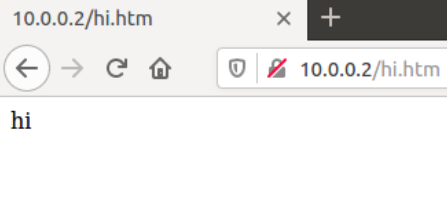

# 20220214 課堂筆記
## 課程使用環境 [Ubuntu 16.04](https://releases.ubuntu.com/16.04/ubuntu-16.04.7-desktop-amd64.iso)
## 安裝 Mininet
* git clone https://github.com/mininet/mininet.git
* cd mininet 
* util/install.sh -a
    - `-a`：安裝全部的套件
## Mininet 的基礎指令
* 啟動 mininet：`mn`
* 開啟 host 終端機：`xterm`
```
mininet> xterm h1 h2
```
* 離開 mininet：`exit`
## 課堂實作
### 開啟終端機 h1 h2
```
mininet> xterm h1 h2
```
### 在 h2 新增一個`hi.htm`
```
h2> echo "hi" > hi.htm
```
### 啟動網頁伺服器
```
h2> python -m SimpleHTTPServer 80
```
### 在 h1 查看網頁內容
```
h1> curl http://10.0.0.2/hi.htm
```
### 在 Firefox 瀏覽器中查看

