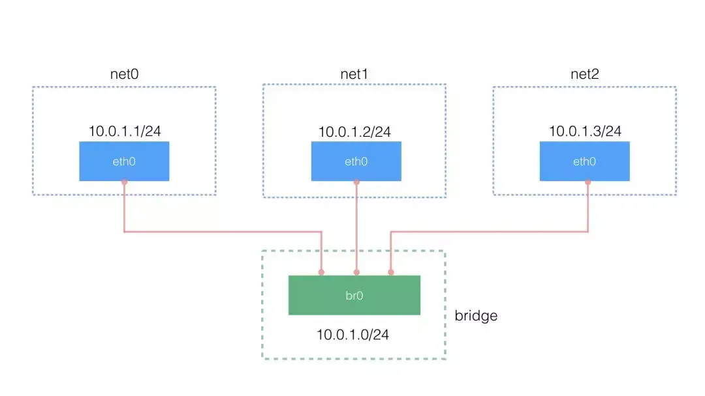
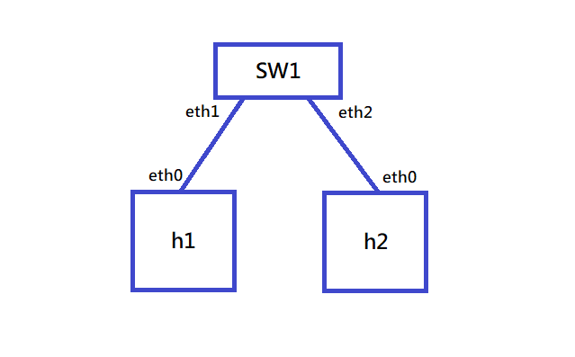
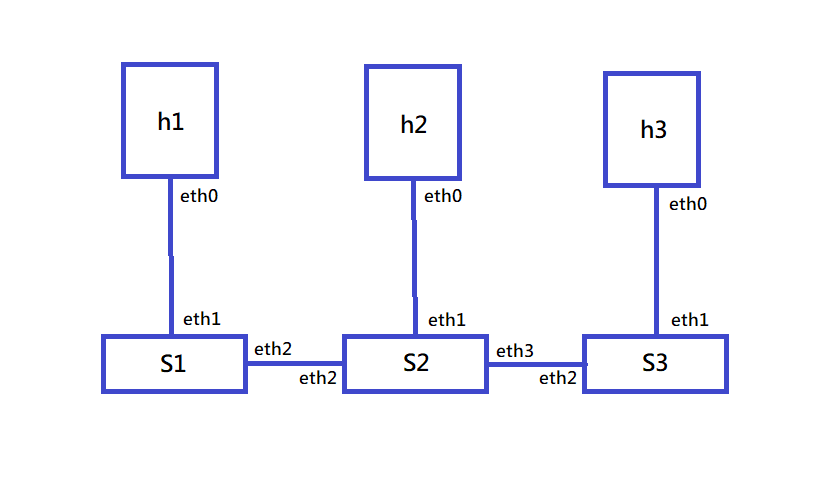
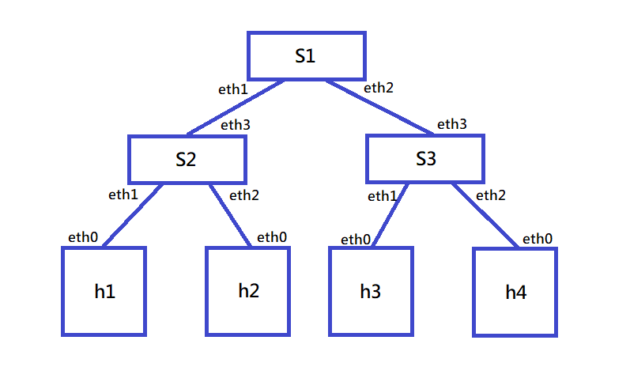

# 20220221 課堂筆記
## 在 Mininet 中使用 network namespace
### network namespace 的基礎指令
* 創建一個 network namespace
    - ip netns add net1
* 在新的 namespace 中執行指令
    - ip netns exec net1 `+指令`
* 創建 veth pair，一對虛擬網路卡(Virtual Ethernet)
    - ip link add type veth
*  將 veth 加入 namespace 中
    - ip link set veth0 netns net0 
    - ip link set veth1 netns net1 
### 課程範例


#### 建立一個 bridge
* 安裝相關套件
    - apt install bridge-utils
* 創建一個 bridge `br0`
    - ip link add br0 type bridge
* 啟動 br0
    - ip link set dev br0 up
* 查看 bridge 的狀態
    - brctl show
#### 創建三個 veth pair
```
# ip link add type veth 
# ip link add type veth 
# ip link add type veth
```
#### 創建三個空間
```
# ip netns add net0
# ip netns add net1
# ip netns add net2
```
#### 將 veth pair 的一頭掛到 namespace，另一頭掛到 bridge，並配置 IP
* 配置 net0
```
# ip link set dev veth1 netns net0
# ip netns exec net0 ip link set dev veth1 name eth0
# ip netns exec net0 ip addr add 10.0.1.1/24 dev eth0
# ip netns exec net0 ip link set dev eth0 up
# ip link set dev veth0 master br0
# ip link set dev veth0 up
```
* 配置 net1
```
# ip link set dev veth3 netns net1
# ip netns exec net1 ip link set dev veth3 name eth0
# ip netns exec net1 ip addr add 10.0.1.2/24 dev eth0
# ip netns exec net1 ip link set dev eth0 up
# ip link set dev veth2 master br0
# ip link set dev veth2 up
```
* 配置 net2
```
# ip link set dev veth5 netns net2
# ip netns exec net2 ip link set dev veth5 name eth0
# ip netns exec net2 ip addr add 10.0.1.3/24 dev eth0
# ip netns exec net2 ip link set dev eth0 up
# ip link set dev veth4 master br0
# ip link set dev veth4 up
```
#### 將 veth0 veth2 veth4 掛載到 br0 上
```
# ip link set dev veth0 master br0
# ip link set dev veth2 master br0
# ip link set dev veth4 master br0
```
* 檢查是否掛載成功
    - brctl show
```
# ip link set dev veth0 up
# ip link set dev veth2 up
# ip link set dev veth4 up
```
* 檢查狀態
    - ifconfig
* 測試可否相互通訊
```
# ip netns exec net0 ping 10.0.1.2 -c 3
# ip netns exec net0 ping 10.0.1.3 -c 3
```
#### 刪除配置
```
# brctl delif br0 veth0
# brctl delif br0 veth2
# brctl delif br0 veth4
# brctl show
# ip link delete veth0
# ip link delete veth2
# ip link delete veth4
# ifconfig br0 down
# brctl delbr br0 
# ifconfig
# ip netns del net0
# ip netns del net1
# ip netns del net2
# ip netns ls
```
## Mininet 的基礎
### 使用`mn`指令產生基本架構
#### `mn`產生的架構


#### `mn --topo linear,3`產生的架構


#### `mn --topo tree,2`產生的架構

