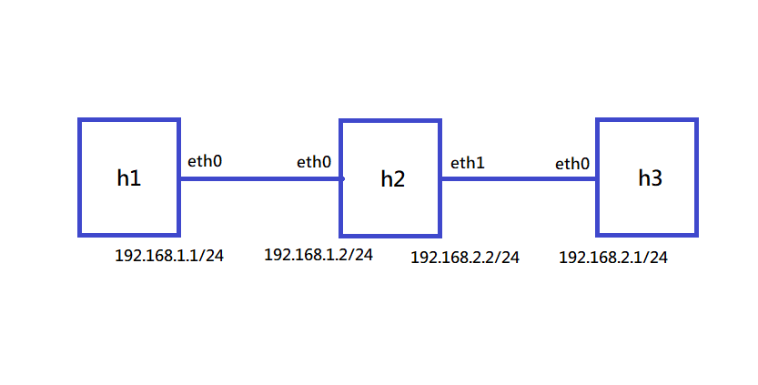

# 20220307 課堂筆記
## 使用 python 腳本建立環境
### 課堂練習一


#### 腳本`1.py`
```py
#!/usr/bin/python
from mininet.cli import CLI  #command line interface
from mininet.net import Mininet
from mininet.link import Link,TCLink,Intf
if '__main__'==__name__:
  net=Mininet(link=TCLink)
  h1=net.addHost('h1')
  h2=net.addHost('h2')
  Link(h1,h2)
  net.build()
  CLI(net)  #命令提示符號
  net.stop()
```
#### 執行`1.py`
```
# chmod +x 1.py
# ./1.py
mininet> xterm h1 h2
```
#### h1 h2 互 ping 測試
```
h1> ping 10.0.0.2
h2> ping 10.0.0.1
```
#### 重新配置 IP
```
h1> ifconfig h1-eth0 0
h1> ip addr add 192.168.1.1/24 brd + dev h1-eth0
h2> ifconfig h2-eth0 0
h2> ip a a 192.168.1.1/24 brd + dev h1-eth0
```
### 課堂練習二
* 直接在腳本中寫入欲更改之 IP 指令
#### 腳本`2.py`
```py
#!/usr/bin/python

from mininet.cli import CLI
from mininet.net import Mininet
from mininet.link import Link,TCLink,Intf

if '__main__'==__name__:
net=Mininet(link=TCLink)
h1=net.addHost('h1')
h2=net.addHost('h2')
Link(h1,h2)
net.build()
h1.cmd("ifconfig h1-eth0 0")
h1.cmd("ip a a 192.168.1.1/24 brd + dev h1-eth0")
h2.cmd("ifconfig h2-eth0 0")
h2.cmd("ip a a 192.168.1.2/24 brd + dev h2-eth0")
CLI(net)
net.stop()
```
### 課堂練習三


* 實現不同網域的互 ping
#### 腳本`3.py`
```py
#!/usr/bin/python

from mininet.cli import CLI
from mininet.net import Mininet
from mininet.link import Link,TCLink,Intf

if '__main__'==__name__:
  net=Mininet(link=TCLink)
  h1=net.addHost('h1')
  h2=net.addHost('h2')
  h3=net.addHost('h3')
  Link(h1,h2)
  Link(h2,h3)
  net.build()
  h1.cmd("ifconfig h1-eth0 0")
  h1.cmd("ip a a 192.168.1.1/24 brd + dev h1-eth0")

  h2.cmd("ifconfig h2-eth0 0")
  h2.cmd("ip a a 192.168.1.2/24 brd + dev h2-eth0")
  h2.cmd("ifconfig h2-eth1 0")
  h2.cmd("ip a a 192.168.2.2/24 brd + dev h2-eth1")

  h3.cmd("ifconfig h3-eth0 0")
  h3.cmd("ip a a 192.168.2.1/24 brd + dev h3-eth0")

  h1.cmd("ip route add default via 192.168.1.2")
  h3.cmd("ip route add default via 192.168.2.2")
  h2.cmd("echo 1 > /proc/sys/net/ipv4/ip_forward")

  CLI(net)
  net.stop()
```
#### 查看路由狀態
```
h1> routw -n
h1> ip route show
```
### 課堂練習四


#### 腳本`4.py`
```py
#!/usr/bin/python

from mininet.cli import CLI
from mininet.net import Mininet
from mininet.link import Link,TCLink,Intf

if '__main__'==__name__:
  net=Mininet(link=TCLink)
  h1=net.addHost('h1')
  h2=net.addHost('h2')
  h3=net.addHost('h3')
  br0=net.addHost('br0')
  Link(h1,br0)
  Link(h2,br0)
  Link(h3,br0)
  net.build()
  br0.cmd("brctl addbr mybr")
  br0.cmd("brctl addif mybr br0-eth0")
  br0.cmd("brctl addif mybr br0-eth1")
  br0.cmd("brctl addif mybr br0-eth2")
  br0.cmd("ifconfig mybr up")
  CLI(net)
  net.stop()
```
### 課堂練習五
#### arp poisoning
* 安裝 dsniff
    - apt install dsniff


* `h1`傳訊息給`h2`
* `h3`偽裝成`h2`欺騙`h1`，取得`h1`封包
* `h3`偽裝成`h1`欺騙`h2`，將封包轉送給`h2`
##### `h3`攻擊`h1`及`h2`
```
h3> arpspoof -i h3-eth0 -t 10.0.0.1 10.0.0.2
h3> arpspoof -i h3-eth0 -t 10.0.0.2 10.0.0.1
```
##### 防範方法-使用靜態 arp
```
h1> arp -s 10.0.0.2 00:00:00:00:00:02
h2> arp -s 10.0.0.1 00:00:00:00:00:01
```