# 20220307 課堂筆記
## 使用圖形化介面工具`MiniEdit`建構網路
### 執行`miniedit.py`
```
# cd mininet/examples
# ./miniedit.py
```
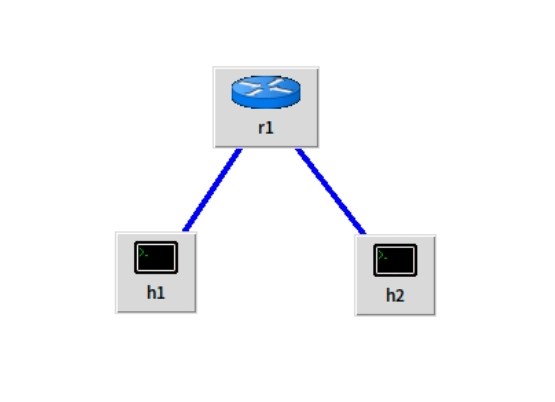

## 使用效能量測工具`iperf`
* 安裝`iperf`
    - apt install iperf
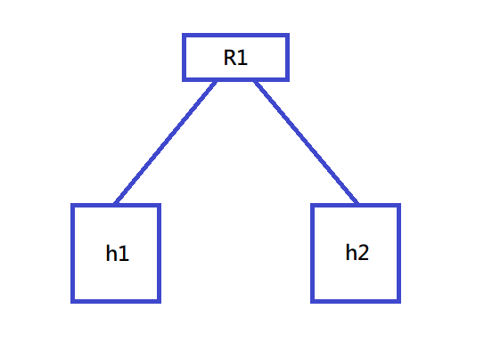
### 更改後的腳本`3.py`
```py
#!/usr/bin/python

from mininet.cli import CLI
from mininet.net import Mininet
from mininet.link import Link,TCLink,Intf

if '__main__'==__name__:
  net=Mininet(link=TCLink)
  h1=net.addHost('h1')
  h2=net.addHost('h2')
  r=net.addHost('r')
  
  Link(h1,r)
  Link(h2,r)
  net.build()

  h1.cmd("ifconfig h1-eth0 0")
  h1.cmd("ip a a 192.168.1.1/24 brd + dev h1-eth0")
  h1.cmd("ip route add default via 192.168.1.254")
  h2.cmd("ifconfig h2-eth0 0")
  h2.cmd("ip a a 192.168.2.1/24 brd + dev h2-eth0")
  h2.cmd("ip route add default via 192.168.2.254")

  r.cmd("ifconfig r-eth0 0")
  r.cmd("ifconfig r-eth1 0")
  r.cmd("ip a a 192.168.1.254/24 brd + dev r-eth0")
  r.cmd("ip a a 192.168.2.254/24 brd + dev r-eth1")
  r.cmd("echo 1 > /proc/sys/net/ipv4/ip_forward")
  CLI(net)
  net.stop()
```
### 執行`3.py`
```
# ./3.py
mininet> xterm h1 h2
h2> iperf -s -i 1  #伺服器每秒鐘的吞吐量 -s:server -i 1:每一秒偵測一次
h1> iperf -c 192.168.1.2 -t 10  #-t 10:傳送10秒，若未指定以TCP傳送
```
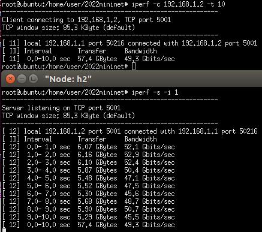
### 使用兩條線路並限制其速度，再以不同埠號來監測限制後的速度
```
# ./3.py
mininet> xterm h1 h2 h1 h2
h2> iperf -s -i 1 -u  #-u:以UDP傳送
h1> iperf -c 192.168.1.2 -u -b 100M -t 100  #-b 100M:將速度限制在100M
h2> iperf -s -i 1 -u -p 5555  #-p 5555:傳送到埠號5555的伺服器
h1> iperf -c 192.168.1.2 -u -b 200M -t 100 -p 5555
```
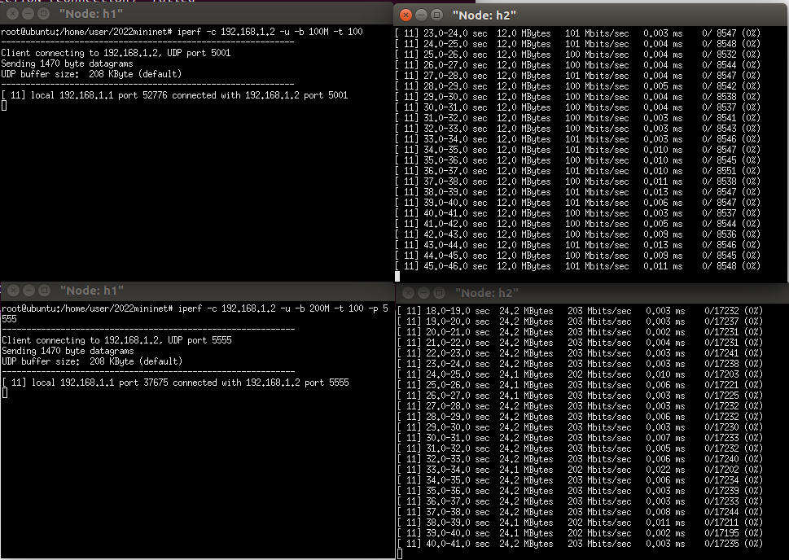
## 使用`gnuplot`將數據化為圖表
* 安裝`gnuplot`
    - apt install gnuplot
### 輸出圖表觀察 TCP 和 UDP 同時跑的情況
#### 加入線路參數修改後的`3.py`
```py
#!/usr/bin/python

from mininet.cli import CLI
from mininet.net import Mininet
from mininet.link import Link,TCLink,Intf

if '__main__'==__name__:
  net=Mininet(link=TCLink)
  h1=net.addHost('h1')
  h2=net.addHost('h2')
  r=net.addHost('r')
  h1r = {'bw':100,'delay':'1ms','loss':0}  
  net.addLink(h1, r, cls=TCLink , **h1r)
  h2r = {'bw':100,'delay':'1ms','loss':0}
  net.addLink(h2, r, cls=TCLink , **h2r)
  Link(h1,r)
  Link(h2,r)
  net.build()

  h1.cmd("ifconfig h1-eth0 0")
  h1.cmd("ip a a 192.168.1.1/24 brd + dev h1-eth0")
  h1.cmd("ip route add default via 192.168.1.254")
  h2.cmd("ifconfig h2-eth0 0")
  h2.cmd("ip a a 192.168.2.1/24 brd + dev h2-eth0")
  h2.cmd("ip route add default via 192.168.2.254")

  r.cmd("ifconfig r-eth0 0")
  r.cmd("ifconfig r-eth1 0")
  r.cmd("ip a a 192.168.1.254/24 brd + dev r-eth0")
  r.cmd("ip a a 192.168.2.254/24 brd + dev r-eth1")
  r.cmd("echo 1 > /proc/sys/net/ipv4/ip_forward")
  CLI(net)
  net.stop()
```
#### 執行腳本`3.py`
```
# ./3py
mininet> xterm h1 h2 h1 h2
h2(1)> iperf -s -i 1 -p 5555 | tee tcp
h2(2)> iperf -s -i 1 -u -p 6666 | tee udp
h1(2)> iperf -c 192.168.2.1 -u -b 50M -t 30 -p 6666
h1(1)> iperf -c 192.168.2.1 -t 50 -p 5555
```
#### 將結果簡化並存到`tcp_result` `udp_result`
```
h2(1)> cat tcp | grep "sec" |head -n 50 | tr "-" " " | awk '{print $4,$8}' > tcp_result
h2(2)> cat udp | grep "sec" | grep -v out-of-order | tr "-" " " | head -n 30 | awk '{print $4,$8}' > udp_result
```
#### 將`gnuplot`指令寫成腳本`plot.plt`
```
plot "result" with linespoints #用點線繪製
set xlabel "time (sec)"
set ylabel "throughput (Mbps)"
set xrange [1:10]
set xtics 0,1,10
set yrange [0:100]
set ytics 0,10,100
set title "TCP Flow Throughput"
set terminal gif #設定繪製格式
set output "result.gif" #設定輸出檔名
replot #重新繪製圖表
```
#### 輸出指令
* gnuplot plot.plt

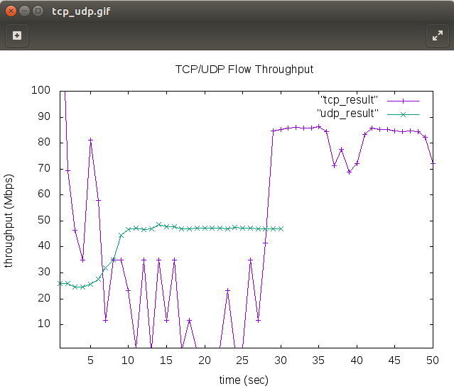
## 使用[Ettercap](https://www.ettercap-project.org/downloads.html)圖形化介面
### 安裝 Ettercap
#### 解壓
```
# tar vfxz ettercap-0.8.3.1.tar.gz
```
#### 想編譯成功 Ettercap，必須安裝一些依賴庫，執行以下命令安裝
```
sudo apt-get install debhelper bison check cmake flex ghostscript libbsd-dev libcurl4-openssl-dev libgeoip-dev libltdl-dev libluajit-5.1-dev libncurses5-dev libnet1-dev libpcap-dev libpcre3-dev libssl-dev libgtk-3-dev libgtk2.0-dev
```
#### 進入解壓後的 Ettercap 資料夾並執行下列命令
```
# cd ettercap-0.8.3.1/
# mkdir build
# cd build
# cmake ../
# make install
```
#### 執行 Ettercap
* ettercap -G

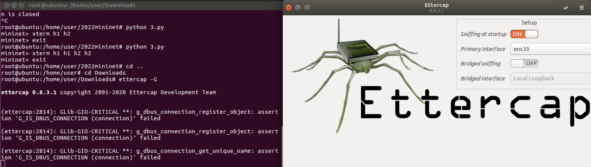
### 實作 arp poisoning
#### 使用腳本`4.py`
```py
#!/usr/bin/python

from mininet.cli import CLI
from mininet.net import Mininet
from mininet.link import Link,TCLink,Intf

if '__main__'==__name__:
  net=Mininet(link=TCLink)
  h1=net.addHost('h1')
  h2=net.addHost('h2')
  h3=net.addHost('h3')
  br=net.addHost('br')
  Link(h1,br)
  Link(h2,br)
  Link(h3,br)
  net.build()
  h1.cmd("ifconfig h1-eth0 0")
  h2.cmd("ifconfig h2-eth0 0")
  h3.cmd("ifconfig h3-eth0 0")
  h1.cmd("ifconfig br-eth0 0")
  h2.cmd("ifconfig br-eth1 0")
  h3.cmd("ifconfig br-eth2 0")
  br.cmd("brctl addbr mybr")
  br.cmd("brctl addif mybr br-eth0")
  br.cmd("brctl addif mybr br-eth1")
  br.cmd("brctl addif mybr br-eth2")
  br.cmd("ifconfig mybr up")

  h1.cmd("ip a a 192.168.10.1/24 dev h1-eth0")
  h2.cmd("ip a a 192.168.10.2/24 dev h2-eth0")
  h3.cmd("ip a a 192.168.10.3/24 dev h3-eth0")
  h1.cmd("ifconfig h1-eth0 hw ether 00:00:00:00:00:01")
  h2.cmd("ifconfig h2-eth0 hw ether 00:00:00:00:00:02")
  h3.cmd("ifconfig h3-eth0 hw ether 00:00:00:00:00:03")
  CLI(net)
  net.stop()
```
#### 輸入指令開啟`Ettercap`並監測`wireshark`
```
# ./4.py
mininet> xterm h1 h2 h3
h3> wireshark
h1> ping 10.0.0.2
h3> ettercap -G
```
#### 掃描有連接的主機
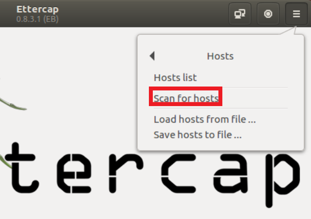
#### 查看 Hosts list，並設定攻擊目標
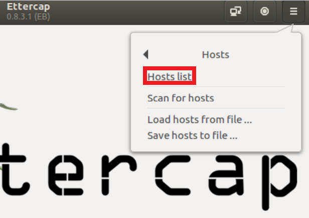

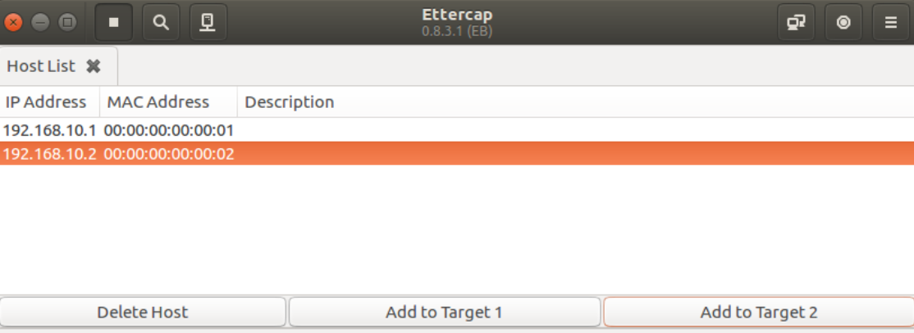
#### 開始 arp poisoning
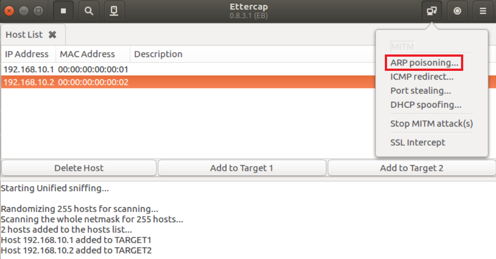
#### 在`h3`開啟的`wireshark`即可監測到
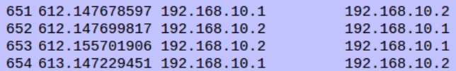
#### 在`h1` `h2`設定靜態 arp，防止封包竊取
```
h1> arp -s 192.168.10.2 00:00:00:00:00:02
h2> arp -s 192.168.10.1 00:00:00:00:00:01
```
#### 此時開始欺騙交換機來達成封包竊取
* 按下紅框後選擇`Port stealing...`

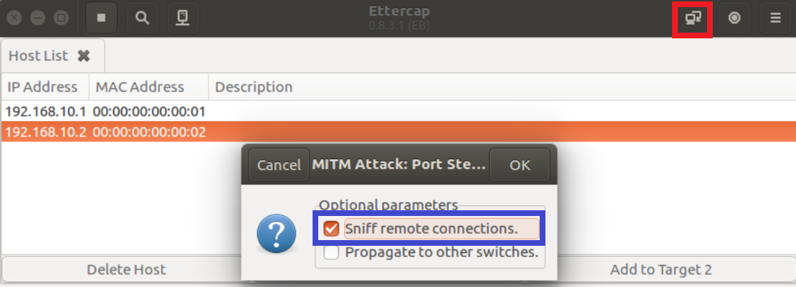
#### 結果
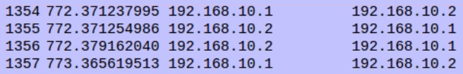
#### 防範方法-在 switch port 將網路卡卡號寫死