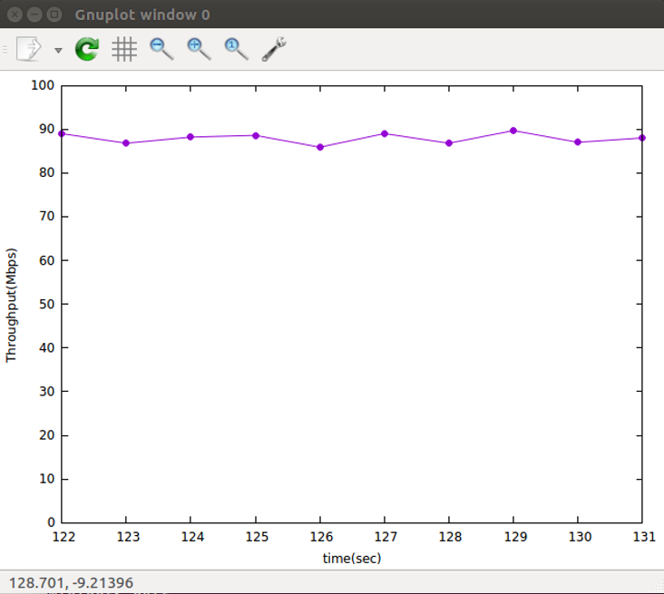

# 20220321 課堂筆記
## 在動態的狀態下將網速繪製輸出
### 使用腳本`3-1.py`
```py
#!/usr/bin/python

from mininet.cli import CLI
from mininet.net import Mininet
from mininet.link import Link,TCLink,Intf

if '__main__'==__name__:
  net=Mininet(link=TCLink)
  h1=net.addHost('h1')
  h2=net.addHost('h2')
  r=net.addHost('r')
  h1r = {'bw':100,'delay':'1ms','loss':0}  ## delay:延遲時間 loss:遺失率
  net.addLink(h1, r, cls=TCLink , **h1r)
  h2r = {'bw':100,'delay':'1ms','loss':0}
  net.addLink(h2, r, cls=TCLink , **h2r)
  Link(h1,r)
  Link(h2,r)
  net.build()

  h1.cmd("ifconfig h1-eth0 0")
  h1.cmd("ip a a 192.168.1.1/24 brd + dev h1-eth0")
  h1.cmd("ip route add default via 192.168.1.254")
  h2.cmd("ifconfig h2-eth0 0")
  h2.cmd("ip a a 192.168.2.1/24 brd + dev h2-eth0")
  h2.cmd("ip route add default via 192.168.2.254")

  r.cmd("ifconfig r-eth0 0")
  r.cmd("ifconfig r-eth1 0")
  r.cmd("ip a a 192.168.1.254/24 brd + dev r-eth0")
  r.cmd("ip a a 192.168.2.254/24 brd + dev r-eth1")
  r.cmd("echo 1 > /proc/sys/net/ipv4/ip_forward")
  CLI(net)
  net.stop()
```
### 使用腳本`process.sh`過濾所需資料
```
filename='a'
> result
> a
b="not"
while true
do
   if [ -s "$filename" ]
   then
        #echo "$filename is NOT empty file."
        while IFS= read -r line
        do
          result=`echo "$line" | grep "sec"`
          if [[ -n $result ]]
          then
            #echo $result
            b="done"
            break
          fi
        done < a
   fi
 
   if [ $b = "done" ]
   then
     break
   fi
done
 
while IFS= read -r line
do
  result=`echo "$line" | grep "sec" | tr "-" " " | awk '{print $4,$8}'`
  if [[ -n $result ]]
  then
    echo $result
    echo $result >> result
    sleep 1
  fi
done < a
```
### 設定好繪製輸出的樣式`gnuplot-plot`
```
FILE = 'result'
stop = 0
 
N = 10
set yrange [0:100]
set ytics 0,10,100
set key off
set xlabel "time(sec)"
set ylabel "Throughput(Mbps)"
 
while (!stop) {  
    pause 0.1       # pause in seconds
    stats [*:*][*:*] FILE u 0 nooutput
    lPnts=STATS_records<N ? 0: STATS_records-N
    plot FILE u 1:2 every ::lPnts w lp pt 7
}
```
### 設定腳本`plot-throughput.sh`
```
filename='result'
while true                
do
   if [ -s "$filename" ]  # 判斷 result 裡面是否有東西存在
   then
        #echo "$filename is NOT empty file."
        break
   fi
done
 
gnuplot gnuplot-plot
```
### 輸入指令，開始繪製
```
# ./3-1.py
mininet> xterm h1 h2 h2 h2
h2(1)> ./process.sh
h2(2)> ./plot-throughput.sh
h2(3)> iperf -s -i 1 > a
h1> iperf -c 192.168.2.1 -t 1000
```

## 如何載入新模組/核心
```
# modprobe 8021q
# cd /
# mdir data
# cd data
# wget https://cdn.kernel.org/pub/linux/kernel/v5.x/linux-5.15.31.tar.xz
# apt-get install gcc make libncurses5-dev openssl libssl-dev build-essential pkg-config libc6-dev bison flex libelf-dev -y
# tar xfJ linux-5.15.31.tar.xz
# uname -r
# cd linux-5.15.31
# cd arch
# cd .. fs  ##檔案系統
# cd .. mm  ##memory management
# cd ..
# cp /boot/config-4.15.0-142-generic .config
# make menuconfig
# make
```