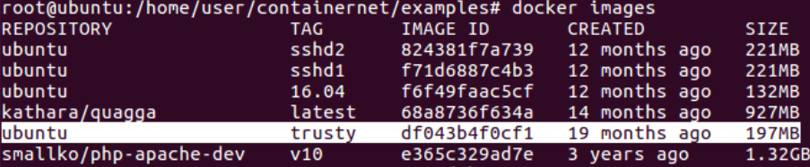
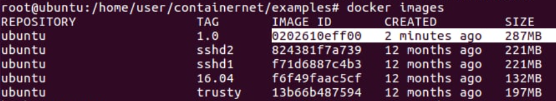

# 20220411 課堂筆記
## Docker
* 測試 Docker 可否運作
```
# cd /home/user/containernet
# python3 ./setup.py install
# cd /home/user/containernet/examples
# python3 dockerhosts.py
containernet> h1 ping -c 3 d1
```
* 檢查有無 ubuntu:trusty 的鏡像
```
# docker images
```


* 如果沒有，輸入下列指令
```
# docker pull ubuntu:trusty
```
### 範例一 與 Doctor 互 ping
#### 腳本`dockerhost1.py`
```py
#!/usr/bin/python

"""
This example shows how to create a simple network and
how to create docker containers (based on existing images)
to it.
"""

from mininet.net import Containernet
from mininet.node import Controller, Docker, OVSSwitch
from mininet.cli import CLI
from mininet.log import setLogLevel, info
from mininet.link import TCLink, Link


def topology():

    "Create a network with some docker containers acting as hosts."

    net = Containernet()

    info('*** Adding hosts\n')
    h1 = net.addHost('h1',  ip='10.0.0.250')

    info('*** Adding docker containers\n')
    d1 = net.addDocker('d1', ip='10.0.0.251', dimage="ubuntu:trusty")
    
    info('*** Creating links\n')
    net.addLink(h1, d1)
   
    info('*** Starting network\n')
    net.start()

    info('*** Running CLI\n')
    CLI(net)

    info('*** Stopping network')
    net.stop()

if __name__ == '__main__':
    setLogLevel('info')
    topology()
```
#### 執行`dockerhost1.py`
```
# cd /home/user/containernet/examples
# gedit dockerhost1.py
# chmod +x dockerhost1.py
# python3 dockerhost1.py
containernet> xterm h1
```
* 查看 Docker 名稱
    - docker ps
* 進入 Docker 環境
    - docker exec -it mn.d1 bash
```
h1> ping 10.0.0.251
```
### 範例二 下載 SSH Server
#### 安裝`openssh-server` `網頁伺服器` `vim`
```
# docker run -it ubuntu:trusty bash
root@32ca18d1c6b0:/# apt update
root@32ca18d1c6b0:/# apt install openssh-server apache2 vim -y
```
#### 修改 SSH 設定
* root 遠端登入在預設的 SSH Server 中是關閉的
    - vim /etc/ssh/sshd_config `在 vim 下，按 a 編輯，將 PermitRootLogin 改為 yes，按 :wq 儲存離開`
#### 啟動 SSH
* /etc/init.d/ssh start
#### 檢視狀態
* /etc/init.d/ssh status
#### 設定 ssh root password
* passwd root
### 範例三 啟動並測試網頁伺服器
```
root@32ca18d1c6b0:/# /etc/init.d/apache2 start
root@32ca18d1c6b0:/# /etc/init.d/apache2 status
root@32ca18d1c6b0:/# cd /var/www/html
root@32ca18d1c6b0:/# echo "hi" > hi.htm
#2 curl 172.17.0.3/hi.htm
```
### 範例四 製作新 Docker 鏡像
```
# docker commit 32c ubuntu:1.0
# docker rm -f 32c
```
#### 輸入`docker images`檢視新增後的鏡像

#### 修改後的`dockerhost1.py`
```py
#!/usr/bin/python

"""
This example shows how to create a simple network and
how to create docker containers (based on existing images)
to it.
"""

from mininet.net import Containernet
from mininet.node import Controller, Docker, OVSSwitch
from mininet.cli import CLI
from mininet.log import setLogLevel, info
from mininet.link import TCLink, Link


def topology():

    "Create a network with some docker containers acting as hosts."

    net = Containernet()

    info('*** Adding hosts\n')
    h1 = net.addHost('h1',  ip='10.0.0.250')

    info('*** Adding docker containers\n')
    d1 = net.addDocker('d1', ip='10.0.0.251', dimage="ubuntu:1.0")
    
    info('*** Creating links\n')
    net.addLink(h1, d1)
   
    info('*** Starting network\n')
    net.start()
    d1.cmd("/etc/init.d/ssh start")
    d1.cmd("/etc/init.d/apache2 start")

    info('*** Running CLI\n')
    CLI(net)

    info('*** Stopping network')
    net.stop()

if __name__ == '__main__':
    setLogLevel('info')
    topology()
```
#### 執行`dockerhost1.py`，測試伺服器
```
# cd /home/user/containernet/examples
# gedit dockerhost1.py
# python3 dockerhost1.py
containernet> xterm h1
h1> ssh root@10.0.0.251
h1> ssh-keygen -f "/root/.ssh/known_hosts" -R 10.0.0.251
h1> curl 10.0.0.251/hi.htm
```