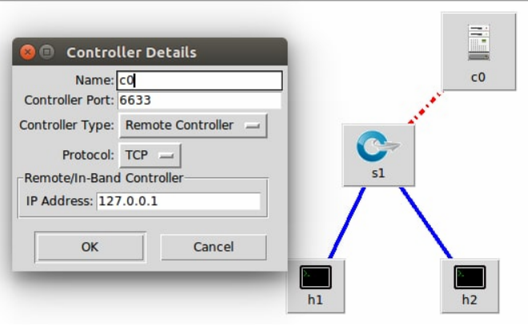
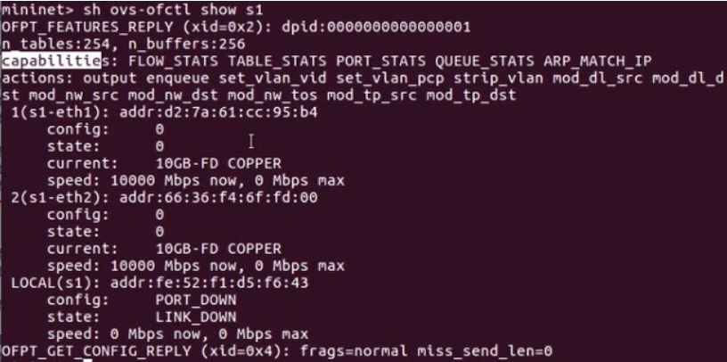
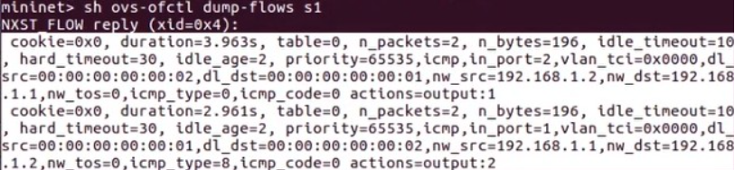
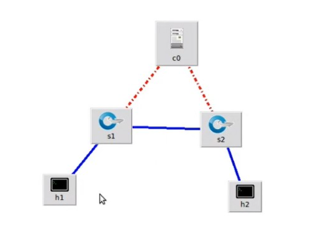

# 20220509 課堂筆記
## 軟體定義網路實作
### 範例一 使用 pox 控制器，將`s1`變為 hub

#### 腳本`test1.py`
```py
#!/usr/bin/python

from mininet.net import Mininet
from mininet.node import RemoteController, OVSKernelSwitch, Host
from mininet.cli import CLI
from mininet.link import TCLink, Intf
from mininet.log import setLogLevel, info
from subprocess import call


def myNetwork():

    ##net = Mininet(topo=None, build=False, ipBase='10.0.0.0/8')
    net = Mininet()

    info( '*** Adding controller\n' )
    c0 = net.addController(name='c0',
                           controller=RemoteController,
                           ip='127.0.0.1',
                           protocol='tcp',
                           port=6633)

    info( '*** Add switches/APs\n')
    s1 = net.addSwitch('s1', cls=OVSKernelSwitch)

    info( '*** Add hosts/stations\n')
    h2 = net.addHost('h2', cls=Host, ip='192.168.1.2/24', mac='00:00:00:00:00:02', defaultRoute=None)
    h1 = net.addHost('h1', cls=Host, ip='192.168.1.1/24', mac='00:00:00:00:00:01', defaultRoute=None)

    info( '*** Add links\n')
    net.addLink(h1, s1)
    net.addLink(s1, h2)

    info( '*** Starting network\n')
    net.build()
    info( '*** Starting controllers\n')
    for controller in net.controllers:
        controller.start()

    info( '*** Starting switches/APs\n')
    net.get('s1').start([c0])

    info( '*** Post configure nodes\n')

    CLI(net)
    net.stop()


if __name__ == '__main__':
    setLogLevel( 'info' )
    myNetwork()

```
#### 執行腳本`test1.py`
```
# python test1.py
mininet> sh ovs-ofctl dump-flows s1
mininet> h1 ping h2 ##失敗
#2 cd pox
#2 ./pox.py forwarding.hub
mininet> h1 ping h2 ##成功
```
* 關閉 pox 控制器後亦可互相通訊的原因是因為規則已寫入
### 範例二 手動寫入規則
#### 執行腳本`test1.py`，查看詳細資訊
```
# python test1.py
mininet> sh ovs-ofctl show s1
```


#### capabilities
* `FLOW_STATS`：規則統計
* `PORT_STATS`：埠號統計
#### actions
* `enqueue`：佇列
* `set_vlan_vid` `set_vlan_pcp` `strip_vlan`：加入移除 vlan 標籤
* `mod_dl_src` `mod_dl_dst`：修改 data link source destination
* `mod_nw_src` `mod_nw_dst` `mod_nw_tos`：修改網路層
* `mod_tp_src` `mod_tp_dst`：修改傳輸層
#### 查看規則


* `idle_timeout=10`：閒置一定時間後刪除
* `hard_timeout=30`：超過時間後強制刪除
* `icmp`：ICMP 封包
* `in_port`：來源埠號
* `dl_src` `dl_dst`：來源及目的之 mac
* `nw_src` `nw_dst`：來源及目的之 IP
* `actions=output:1`：傳送到 1 號埠
* `icmp_type=0`：
    - 0：echo reply 
    - 8：echo request
* 規則由底層向上寫入
    - `in_port` > `mac` > `ip` > `tcp`
#### 執行腳本`test1.py`
* python test1.py
#### 手動寫入 arp 方法一
```
mininet> h1 arp -s 192.168.1.2 00:00:00:00:00:02
mininet> h2 arp -s 192.168.1.1 00:00:00:00:00:01
```
#### 手動寫入 arp 方法二 (不適用於複雜網路，容易造成網路風暴)
```
mininet> sh ovs-ofctl add-flow s1 arp,actions=flood
```
#### 輸入指令並測試
```
mininet> sh ovs-ofctl add-flow s1 ip,dl_dst=00:00:00:00:00:02,nw_dst=192.168.1.2,actions=output:2
mininet> sh ovs-ofctl add-flow s1 dl_type=0x0800,dl_dst=00:00:00:00:00:01,nw_dst=192.168.1.1,actions=output:1
mininet> h1 ping h2
```
### 範例三 添加規則讓`h1` `h2`能互 ping

#### 腳本`test2.py`
```py
#!/usr/bin/python

from mininet.net import Mininet
from mininet.node import RemoteController, OVSKernelSwitch, Host
from mininet.cli import CLI
from mininet.link import TCLink, Intf
from mininet.log import setLogLevel, info
from subprocess import call


def myNetwork():

    net = Mininet()

    info( '*** Adding controller\n' )
    c0 = net.addController(name='c0',
                           controller=RemoteController,
                           ip='127.0.0.1',
                           protocol='tcp',
                           port=6633)

    info( '*** Add switches/APs\n')
    s1 = net.addSwitch('s1', cls=OVSKernelSwitch)
    s2 = net.addSwitch('s2', cls=OVSKernelSwitch)

    info( '*** Add hosts/stations\n')
    h1 = net.addHost('h1', cls=Host, ip='10.0.0.1/24', defaultRoute=None)
    h2 = net.addHost('h2', cls=Host, ip='10.0.0.2/24', defaultRoute=None)

    info( '*** Add links\n')
    net.addLink(h1, s1)
    net.addLink(h2, s2)
    net.addLink(s1, s2)

    info( '*** Starting network\n')
    net.build()
    info( '*** Starting controllers\n')
    for controller in net.controllers:
        controller.start()

    info( '*** Starting switches/APs\n')
    net.get('s1').start([c0])
    net.get('s2').start([c0])

    info( '*** Post configure nodes\n')

    CLI(net)
    net.stop()


if __name__ == '__main__':
    setLogLevel( 'info' )
    myNetwork()

```
#### 執行腳本`test2.py`
```
# python test2.py
mininet> sh ovs-ofctl add-flow s1 arp,actions=flood
mininet> sh ovs-ofctl add-flow s2 arp,actions=flood
mininet> sh ovs-ofctl add-flow s1 ip,nw_dst=10.0.0.1,action=output:1
mininet> sh ovs-ofctl add-flow s1 ip,nw_dst=10.0.0.2,action=output:2
mininet> sh ovs-ofctl add-flow s2 ip,nw_dst=10.0.0.1,action=output:2
mininet> sh ovs-ofctl add-flow s2 ip,nw_dst=10.0.0.2,action=output:1
```