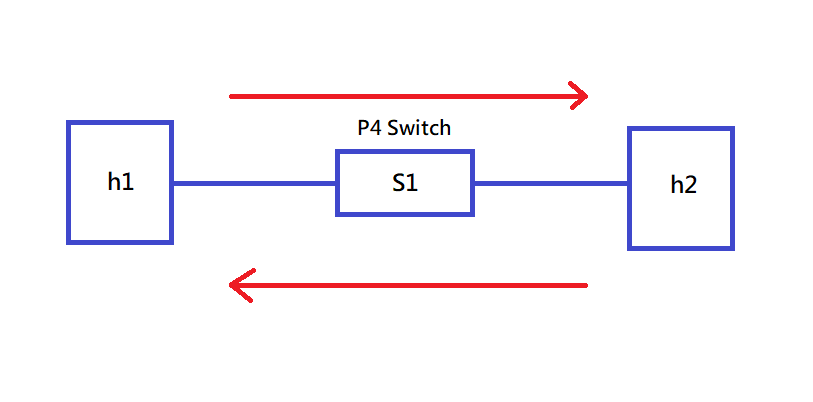
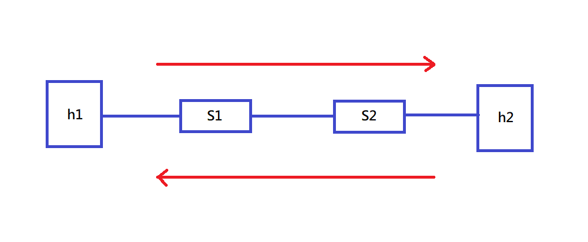
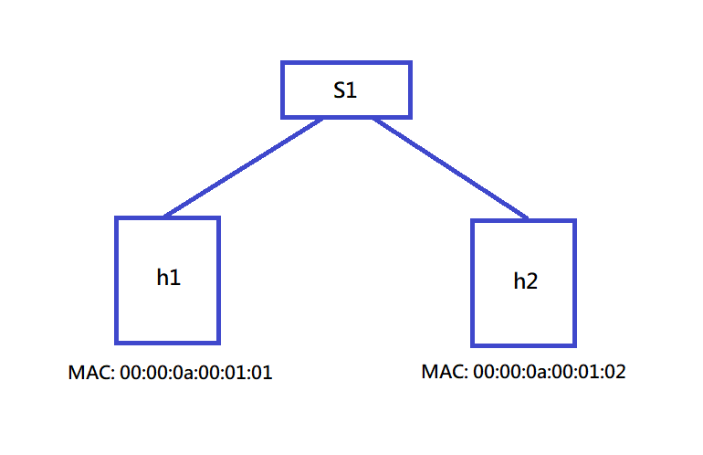
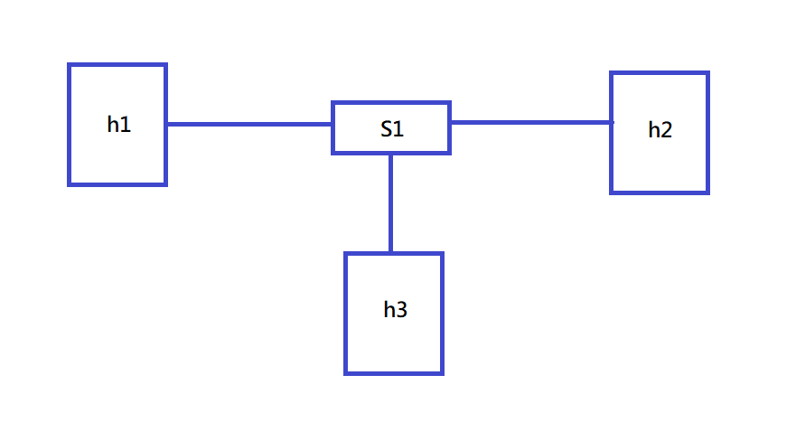

# 20220530 課堂筆記
## SDN 第二代 P4 switch
### 範例一 基本架構

#### 建立環境
```
# cd /home/user/p4-test/1
# p4run
#2 simple_switch_CLI --thrift-port 9090
```
#### 查看規則
```
RuntimeCmd: table_dump phy_forward
```
#### 刪除規則
```
RuntimeCmd: table_delete phy_forward 0
RuntimeCmd: table_delete phy_forward 1
```
#### 輸入指令測試 (失敗)
```
mininet> h1 ping h2 -c 3
```
#### 添加規則
```
RuntimeCmd: table_add phy_forward forward 1 => 2
RuntimeCmd: table_add phy_forward forward 2 => 1
```
#### 輸入指令測試 (成功)
```
mininet> h1 ping h2 -c 3
```
#### 新增規則的其他方法
```
# simple_switch_CLI --thrift-port 9090 < cmd.txt
```
### 範例二

#### 編輯腳本`p4app.json`建立架構
```json
{
  "program": "basic.p4",
  "switch": "simple_switch",
  "compiler": "p4c",
  "options": "--target bmv2 --arch v1model --std p4-16",
  "switch_cli": "simple_switch_CLI",
  "cli": true,
  "pcap_dump": false,
  "enable_log": false,
  "topo_module": {
    "file_path": "",
    "module_name": "p4utils.mininetlib.apptopo",
    "object_name": "AppTopoStrategies"
  },
  "controller_module": null,
  "topodb_module": {
    "file_path": "",
    "module_name": "p4utils.utils.topology",
    "object_name": "Topology"
  },
  "mininet_module": {
    "file_path": "",
    "module_name": "p4utils.mininetlib.p4net",
    "object_name": "P4Mininet"
  },
  "topology": {
    "links": [["h1", "s1"], ["h2", "s2"], ["s1", "s2"]],
    "hosts": {
      "h1": {
      },
      "h2": {
      }
    },
    "switches": {
      "s1": {
        "cli_input": "cmd.txt",
        "program": "basic.p4"
      },
      "s2": {
        "cli_input": "cmd.txt",
        "program": "basic.p4"
      }
    }
  }
}
```
#### 重新設定網路配置
```
# cp -r 1 1-a
# cd /home/user/p4-test/1-a
# rm basic.json basic.p4i topology.db
# p4run
mininet> h2 ifconfig h2-eth0 0
mininet> h2 ip addr add 10.0.1.2/24 brd + dev h2-eth0
mininet> h1 ping h2 -c 3
```
#### 直接在腳本`p4app.json`更改 IP
```json
{
  "program": "basic.p4",
  "switch": "simple_switch",
  "compiler": "p4c",
  "options": "--target bmv2 --arch v1model --std p4-16",
  "switch_cli": "simple_switch_CLI",
  "cli": true,
  "pcap_dump": false,
  "enable_log": false,
  "topo_module": {
    "file_path": "",
    "module_name": "p4utils.mininetlib.apptopo",
    "object_name": "AppTopoStrategies"
  },
  "controller_module": null,
  "topodb_module": {
    "file_path": "",
    "module_name": "p4utils.utils.topology",
    "object_name": "Topology"
  },
  "mininet_module": {
    "file_path": "",
    "module_name": "p4utils.mininetlib.p4net",
    "object_name": "P4Mininet"
  },
  "topology": {
    "assignment_strategy": "l2",  
    "links": [["h1", "s1"], ["h2", "s2"], ["s1", "s2"]],
    "hosts": {
      "h1": {
      },
      "h2": {
      }
    },
    "switches": {
      "s1": {
        "cli_input": "cmd.txt",
        "program": "basic.p4"
      },
      "s2": {
        "cli_input": "cmd.txt",
        "program": "basic.p4"
      }
    }
  }
}
```
### 範例三

#### 新增規則
```
table_add mac_forward forward 00:00:0a:00:01:01 => 1
table_add mac_forward forward 00:00:0a:00:01:02 => 2
```
#### 執行並測試
```
cd /home/user/p4-test/2
p4run
mininet> h1 ping h2 -c 3
```
### 範例四 使`h1` `h2` `h3`可以互相溝通

#### 修改腳本`p4app.json`
```json
{
  "program": "basic.p4",
  "switch": "simple_switch",
  "compiler": "p4c",
  "options": "--target bmv2 --arch v1model --std p4-16",
  "switch_cli": "simple_switch_CLI",
  "cli": true,
  "pcap_dump": true,
  "enable_log": true,
  "topo_module": {
    "file_path": "",
    "module_name": "p4utils.mininetlib.apptopo",
    "object_name": "AppTopoStrategies"
  },
  "controller_module": null,
  "topodb_module": {
    "file_path": "",
    "module_name": "p4utils.utils.topology",
    "object_name": "Topology"
  },
  "mininet_module": {
    "file_path": "",
    "module_name": "p4utils.mininetlib.p4net",
    "object_name": "P4Mininet"
  },
  "topology": {
    "links": [["h1", "s1"], ["h2", "s1"], ["h3", "s1"]],
    "hosts": {
      "h1": {
      },
      "h2": {
      },
      "h3": {
      }
    },
    "switches": {
      "s1": {
        "cli_input": "cmd.txt",
        "program": "basic.p4"
      }
    }
  }
}
```
#### 測試
```
p4run
mininet> h1 ping h2 -c 3
```